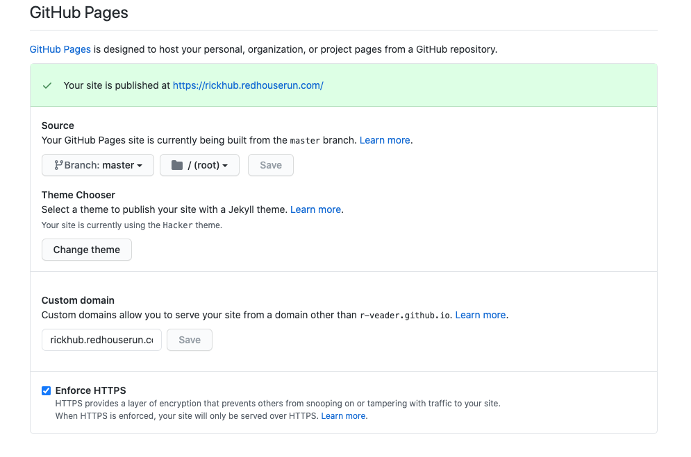

# **Let's Encrypt** our **Git Page**!

---

### First you need to own a domain.

I owned one on namecheap.com

---?color=linear-gradient(180deg, white 75%, black 25%)
@title[Customize Slide Layout]

@snap[west span-55]
## But any registrar will do!
@snapend

@snap[north-east span-45]

@snapend

@snap[south span-100]
@snapend

---

### The arcane magic

Add two Domain Name Service (DNS) records on your domain registrar

1. CNAME (The subdomain for your Git Page)
2. CAA (Certificate Authorization Authority)

Your registrar or friendly DNS admin *will* help with this if you speak the magic words!

---

###The Magic Words###

"I need to add some DNS records to my domain's DNS"

*YOURSUBDOMAIN* CNAME *yourGitHubUserName*.github.io

*YOURSUBDOMAIN* CAA 0 issue “letsencrypt.org”

---

###Real Examples!###

for my site **rickhub.redhouserun.com** *rickhub* is the subdomain and *redhouserun.com* is the domain 

rickhub CNAME "r-veader.github.io"

rickhub CAA 0 issue "letsencrypt.org"

---

###The Github part###

In your Github repository:
- Click the gear for settings
- Scroll down to the Github Pages section
- Add your custom domain name
- Wait a bit
- Go back to the same place and check the "Enforce HTTPS" option that appears!
@snap[north-east span-45]

@snapend
